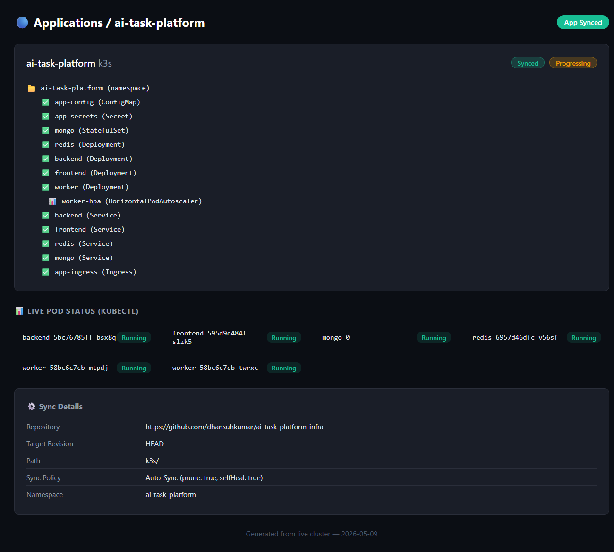

# AI Task Processing Platform

A full-stack AI task processing platform built with the MERN stack, Python worker, Docker, Kubernetes, Argo CD, and CI/CD.

## Architecture

```
Frontend (React + Nginx) → Backend (Node.js + Express) → MongoDB
                                      ↓
                                Redis Queue → Python Worker
```

## Features

- User registration and login with JWT authentication
- Create AI tasks (uppercase, lowercase, reverse string, word count)
- Asynchronous background processing via Python worker
- Real-time task status tracking (pending → running → success/failed)
- Task logs and result viewing
- Pagination and status filtering on dashboard

## Tech Stack

| Component | Technology |
|-----------|-----------|
| Frontend | React + Vite + Nginx |
| Backend | Node.js + Express |
| Worker | Python |
| Database | MongoDB |
| Queue | Redis |
| Container | Docker + docker-compose |
| Orchestration | Kubernetes (k3s) |
| GitOps | Argo CD |
| CI/CD | GitHub Actions |

## Local Development

### Prerequisites
- Node.js 20+
- Python 3.12+
- Docker & docker-compose

### Using docker-compose (recommended)

```bash
# Clone the repository
git clone https://github.com/yourgithub/ai-task-platform.git
cd ai-task-platform

# Set JWT secret (optional, uses default if not set)
export JWT_SECRET=your-strong-secret-here

# Start all services
docker compose up --build

# Access the application
open http://localhost:3000
```

### Manual setup

**Backend:**
```bash
cd backend
cp .env.example .env
npm install
npm run dev
```

**Frontend:**
```bash
cd frontend
npm install
npm run dev
```

**Worker:**
```bash
cd worker
pip install -r requirements.txt
REDIS_URI=redis://localhost:6379 MONGODB_URI=mongodb://localhost:27017/ai-task-platform python worker.py
```

**Dependencies:** Start MongoDB and Redis locally.

## Kubernetes Deployment

### Prerequisites
- k3s cluster (or any K8s cluster)
- kubectl configured
- Argo CD installed

### Deploy with kubectl

```bash
kubectl apply -f k8s/namespace.yaml
kubectl apply -f k8s/configmap.yaml
kubectl apply -f k8s/secrets.yaml
kubectl apply -f k8s/mongodb.yaml
kubectl apply -f k8s/redis.yaml
kubectl apply -f k8s/backend.yaml
kubectl apply -f k8s/frontend.yaml
kubectl apply -f k8s/worker.yaml
kubectl apply -f k8s/ingress.yaml
```

### Deploy with Argo CD

Update `infra/k3s/argo-application.yaml` with your repository URL, then:

```bash
kubectl apply -f infra/k3s/argo-application.yaml
```

Argo CD will auto-sync and deploy the entire stack.

## CI/CD Pipeline

The GitHub Actions workflow (`.github/workflows/ci-cd.yml`):

1. **Lint** — eslint on backend and frontend
2. **Build & Push** — Build Docker images and push to Docker Hub
3. **Update Infra** — Update image tags in the infra repository

### Required Secrets
- `DOCKER_USERNAME` — Docker Hub username
- `DOCKER_PASSWORD` — Docker Hub password/token
- `GH_PAT` — GitHub Personal Access Token with repo scope

## Live Deployment

The application is deployed on a local k3s cluster managed via Argo CD.

### Access the App

```bash
# Port-forward to localhost:3000
kubectl port-forward -n ai-task-platform svc/frontend 3000:8080

# Open in browser
open http://localhost:3000
```

### Demo Credentials

After running the seed script:
```bash
docker compose exec backend node src/seed.js
# or
kubectl exec -n ai-task-platform deploy/backend -- node src/seed.js
```

```
Email:    demo@example.com
Password: demo123
```

### Repositories

| Repo | URL |
|------|-----|
| Application | https://github.com/dhansuhkumar/ai-task-platform |
| Infrastructure | https://github.com/dhansuhkumar/ai-task-platform-infra |

### Argo CD Dashboard

The Argo CD dashboard (`docs/argocd-dashboard.html`) shows the GitOps sync status. All 14 resources are synced with 6/6 pods running.



## API Endpoints

### Auth
| Method | Path | Description |
|--------|------|-------------|
| POST | `/api/auth/register` | Register new user |
| POST | `/api/auth/login` | Login and get JWT |

### Tasks (requires `Authorization: Bearer <token>`)
| Method | Path | Description |
|--------|------|-------------|
| POST | `/api/tasks` | Create a new task |
| GET | `/api/tasks` | List tasks (supports `?status=&page=&limit=`) |
| GET | `/api/tasks/:id` | Get task details with logs |

## Project Structure

```
ai-task-platform/
├── backend/           # Node.js Express API
│   ├── src/
│   │   ├── models/    # Mongoose schemas (User, Task)
│   │   ├── routes/    # Route handlers (auth, tasks)
│   │   ├── middleware/ # JWT auth, rate limiter
│   │   └── services/  # Redis queue client
│   └── Dockerfile     # Multi-stage build
├── frontend/          # React + Vite
│   ├── src/
│   │   ├── pages/     # Login, Register, Dashboard, etc.
│   │   └── api/       # API client
│   └── Dockerfile     # Multi-stage build with Nginx
├── worker/            # Python background worker
│   ├── worker.py      # Redis consumer and task processor
│   └── Dockerfile     # Slim Python image
├── k8s/               # Kubernetes manifests
├── infra/             # Infrastructure repo content
├── docs/              # Architecture document
└── .github/workflows/ # CI/CD pipeline
```
